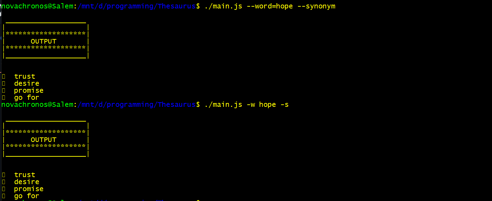
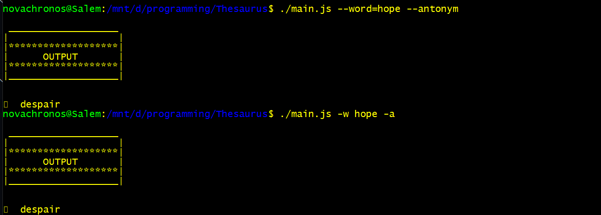
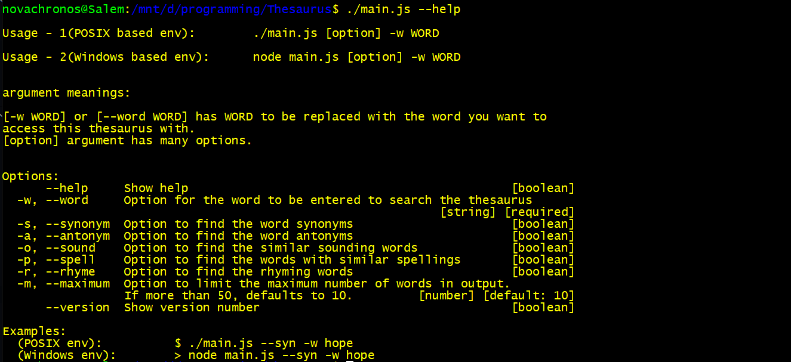

# Thesaurus

> This is a thesaurus based on NodeJS made using datamuse API.

## Table of contents

* [General info](#general-info)
* [Screenshots](#screenshots)
* [Technologies](#technologies)
* [Setup](#setup)
* [Features](#features)
* [Status](#status)
* [Inspiration](#inspiration)
* [Contact](#contact)

## General info

This project is about using the command line to make a thesaurus with different utilities like finding synonyms, antonyms, rhyming words and so much more. I decided to make this project because I wanted to understand the true power asynchronous model of NodeJS and JavaScript in general.

## Screenshots

1. basic usage

2. other option --antonym or -a

3. accessing help using --help or -h

## Technologies

* Node - version 14.15.0
* Git and Github
* Terminal
* Yargs package
* Node Fetch package

## Setup

1. Download and install NodeJS.
2. Clone this repository.
3. Use `npm install` to install the required packages. 
4. Execute the main.js file using appropriate argument and flags.
5. Use --help option to find out more about the usage.

## Features

List of features ready and TODOs for future development

* Find word Synonyms
* Find word Antonyms
* Find similar sounding words
* Find similar spelled words
* Find Rhyming words

To-do list:

* Find other features like finding general form of a word.

## Status

Project is: _finished_

Version 1.0.0 is active. More features will be added soon.

## Inspiration

I wanted to learn by doing. Learn the async aspects of node and put them to use. Learn promises, utilize them and understand them. I also wanted to write shell scripts using JavaScript by making use of NodeJS.

## Contact

Created by [@Goku-kun](https://github.com/Goku-kun) - feel free to contact me!
